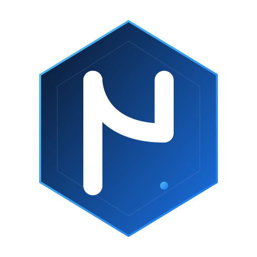

<div align="center">
  <!-- Logo reference -->
  

  # nemOS

  **La puissance de Linux, l'élégance de macOS, la légèreté pour vos vieux PC**

  
  
  
  

  [Télécharger](#-téléchargement) · [Installer](docs/INSTALL.md) · [Construire](docs/BUILD.md) · [Contribuer](#-contribution) · [Signaler un bug](https://github.com/nemesisastarte-gif/nemOS/issues)
</div>

---

## Table des matières

- [Qu'est-ce que nemOS ?](#-quest-ce-que-nemos-)
- [Captures d'écran](#-captures-décran)
- [Fonctionnalités principales](#-fonctionnalités-principales)
- [Configuration minimale requise](#-configuration-minimale-requise)
- [Logiciels préinstallés](#-logiciels-préinstallés)
- [Applications du système](#-applications-du-système)
- [Téléchargement](#-téléchargement)
- [Installation](#-installation)
- [Construction depuis les sources](#-construction-depuis-les-sources)
- [Personnalisation](#-personnalisation)
- [Dépannage](#-dépannage)
- [Contribution](#-contribution)
- [Licence](#-licence)
- [Remerciements](#-remerciements)

---

## 🖥️ Qu'est-ce que nemOS ?

[nemOS](https://github.com/nemesisastarte-gif/nemOS) est une distribution Linux 32-bit ultra-légère conçue spécifiquement pour redonner vie aux ordinateurs anciens et aux machines à ressources limitées. Basée sur [Arch Linux 32](https://www.archlinux32.org/), elle combine la fiabilité et la fraîcheur des paquets d'Arch avec une interface utilisateur soigneusement conçue pour rappeler l'élégance visuelle de macOS, tout en conservant une empreinte mémoire et disque minimale.

### Philosophie

Le projet nemOS repose sur trois piliers fondamentaux :

1. **Légèreté absolue** : chaque composant du système est choisi avec soin pour minimiser l'utilisation de la mémoire vive et de l'espace de stockage. Pas de services superflus, pas d'animations lourdes, pas de démons en arrière-plan qui consomment vos précieuses ressources. Le système complet peut fonctionner avec seulement 512 Mio de mémoire vive, ce qui le rend parfaitement adapté aux netbooks des années 2008-2012, aux PC de bureau d'entrée de gamme et aux machines virtuelles légères.

2. **Élégance macOS-like** : l'interface graphique est construite autour d'un ensemble cohérent d'outils — Openbox comme gestionnaire de fenêtres, Plank comme dock d'application, Tint2 comme barre des tâches supérieure, et un thème GTK3 sombre personnalisé inspiré de l'esthétique de macOS Mojave Dark. Le résultat est un environnement de travail raffiné qui ne sacrifie en rien la performance. Les coins arrondis des fenêtres, les ombres portées subtiles, la transparence du dock et les icônes uniformes contribuent à une expérience visuelle cohérente et agréable.

3. **Simplicité d'accès** : bien que basée sur Arch Linux, nemOS fournit un installateur graphique complet (Calamares), un premier démarrage assisté qui configure automatiquement la locale, le réseau, le clavier et le thème, ainsi qu'un magasin d'applications intégré (nemOS Store) pour installer facilement des logiciels supplémentaires. L'objectif est de rendre l'expérience accessible même aux utilisateurs débutants, tout en conservant la puissance et la flexibilité d'Arch sous le capot.

### Pourquoi nemOS existe-t-il ?

De nombreuses distributions Linux modernes ont abandonné le support 32-bit, rendant des millions d'ordinateurs fonctionnels inutilisables avec les systèmes actuels. Les distributions qui continuent de supporter l'architecture i686 proposent souvent des interfaces austères ou mal optimisées. nemOS a été créé pour combler ce vide : offrir une expérience visuelle moderne et élégante sur du matériel ancien, prouvant qu'un PC de 2009 peut encore offrir une expérience utilisateur agréable et productive en 2025.

L'inspiration visuelle vient de [pearOS](https://github.com/nemesisastarte-gif/pearOS), un projet macOS-like pour architectures modernes. nemOS adapte cette philosophie au monde 32-bit, en remplaçant les composants lourds (GNOME, KDE) par des alternatives légères (Openbox, Plank, PCManFM) qui offrent un rendu visuel similaire sans les exigences matérielles prohibitives.

### Public cible

nemOS s'adresse à plusieurs types d'utilisateurs :

- **Propriétaires de vieux PC** disposant d'un ordinateur avec 1 à 2 Gio de mémoire vive et un processeur 32-bit (Intel Atom, Intel Celeron, AMD Athlon XP ou ultérieur).
- **Étudiants et enseignants** cherchant un système gratuit, léger et en français pour équiper des salles informatiques anciennes.
- **Passionnés de rétro-informatique** souhaitant donner une seconde vie à du matériel vintage avec un système à jour et sécurisé.
- **Développeurs** cherchant un environnement de test léger dans une machine virtuelle pour tester des applications 32-bit.
- **Utilisateurs soucieux de leur empreinte numérique** préférant un système minimal qui ne gaspille pas de ressources.

---

## 📸 Captures d'écran

> **Note** : Les captures d'écran ci-dessous illustrent l'apparence de nemOS. Elles seront ajoutées au fur et à mesure du développement du projet.

### Bureau par défaut

Le bureau nemOS affiche le fond d'écran par défaut « nemOS-Dark », avec le dock Plank centré en bas de l'écran et la barre Tint2 en haut. Les applications essentielles (navigateur Firefox ESR, gestionnaire de fichiers PCManFM, terminal Xfce4) sont épinglées dans le dock pour un accès rapide. Le bureau est volontairement épuré : pas d'icônes encombrantes, pas de widgets superflus, juste un espace de travail propre et fonctionnel.

`[Capture d'écran : Bureau par défaut de nemOS avec le dock Plank, la barre Tint2 et le fond d'écran sombre]`

### Menu d'applications Rofi

En appuyant sur `Alt+F2`, le lanceur d'applications Rofi apparaît au centre de l'écran avec une liste filtrable de toutes les applications installées. Le thème de Rofi est personnalisé pour s'intégrer harmonieusement avec le reste de l'interface sombre.

`[Capture d'écran : Lanceur Rofi avec recherche d'application en cours]`

### Gestionnaire de fichiers PCManFM

Le gestionnaire de fichiers affiche une interface en panneau unique avec une barre latérale pour la navigation rapide. Le thème sombre est appliqué de manière cohérente, y compris aux infobulles et aux menus contextuels.

`[Capture d'écran : PCManFM naviguant dans le répertoire personnel]`

### Thème GTK — Applications sombres

Toutes les applications GTK3 héritent automatiquement du thème « nemOS-Dark », offrant une expérience visuelle uniforme. La capture montre les paramètres système (lxappearance), le lecteur multimédia VLC et l'éditeur de texte Geany, tous cohérents visuellement.

`[Capture d'écran : Plusieurs applications GTK avec le thème sombre appliqué]`

### nemOS Store

Le magasin d'applications intégré permet de parcourir et d'installer facilement des logiciels supplémentaires depuis un catalogue organisé par catégories. L'interface est construite avec PyQt5 pour une intégration native avec le thème du système.

`[Capture d'écran : nemOS Store avec la liste des applications disponibles]`

### Session Live

La session live de nemOS permet de tester le système sans l'installer. L'utilisateur arrive directement sur le bureau fonctionnel avec un accès complet à tous les outils, y compris l'installateur Calamares accessible depuis le dock.

`[Capture d'écran : Session live de nemOS avec l'icône de l'installateur dans le dock]`

---

## ✨ Fonctionnalités principales

nemOS intègre de nombreuses fonctionnalités soigneusement sélectionnées pour offrir une expérience complète et agréable sur du matériel ancien.

### 1. Interface macOS-like avec Openbox + Plank + Tint2

Le cœur visuel de nemOS repose sur la combinaison de trois composants légers travaillant en harmonie. **Openbox** gère le placement et le comportement des fenêtres avec une personnalisation poussée : bordures fines, boutons de fenêtre à la macOS (clos, minimiser, maximiser du côté gauche), raccourcis clavier complets et support des bureaux virtuels. **Plank** sert de dock d'application en bas de l'écran, avec des animations de zoom au survol, des indicateurs d'application ouverte et la possibilité d'épingler ses applications préférées. **Tint2** forme la barre de menus supérieure affichant l'heure, le volume, l'état du réseau et le lanceur d'applications.

### 2. Thème GTK3 « nemOS-Dark » personnalisé

Un thème GTK3 entièrement personnalisé, inspiré de l'esthétique de macOS Mojave Dark, est appliqué par défaut à toutes les applications. Ce thème définit les couleurs de fond, les bordures arrondies, les ombres portées, les dégradés des barres de titre et l'apparence des boutons, des menus déroulants et des barres de défilement. Le résultat est une cohérence visuelle remarquable entre toutes les applications, qu'elles soient natives GTK, Qt (via qt5ct) ou même les boîtes de dialogue système.

### 3. Architecture i686 optimisée

Contrairement à la majorité des distributions modernes qui ont abandonné le support 32-bit, nemOS est exclusivement compilé pour l'architecture i686. Cette décision permet de prendre en charge les processeurs Intel Pentium III, Intel Celeron, Intel Atom (première génération), AMD Athlon XP et tous les processeurs 32-bit ultérieurs. Les paquets sont issus du dépôt Arch Linux 32 et sont régulièrement mis à jour pour bénéficier des dernières corrections de sécurité.

### 4. Installation simplifiée avec Calamares

L'installateur graphique Calamares guide l'utilisateur pas à pas à travers le processus d'installation : choix de la langue, partitionnement (automatique ou manuel), création de l'utilisateur, sélection du fuseau horaire et configuration du clavier. L'interface est traduite en français et les options par défaut sont préconfigurées pour une expérience sans friction. Les utilisateurs avancés peuvent utiliser le partitionnement manuel avec support du LVM, du LUKS et de divers systèmes de fichiers (ext4, btrfs, f2fs).

### 5. Premier démarrage assisté

Au premier lancement après l'installation, un script interactif en console guide l'utilisateur à travers la configuration initiale du système : définition du nom d'hôte, connexion au réseau Wi-Fi, configuration de la locale française, activation du TRIM pour les SSD, création du compte utilisateur avec mot de passe, activation des services essentiels et application du thème visuel. Ce processus est conçu pour être accessible aux débutants tout en permettant aux utilisateurs avancés de personnaliser chaque étape.

### 6. nemOS Store — Magasin d'applications intégré

Le magasin d'applications nemOS Store est une interface graphique légère développée en Python avec PyQt5. Elle permet de parcourir un catalogue de logiciels organisé par catégories (Internet, Multimédia, Bureautique, Développement, Système, Jeux, Graphisme), de rechercher des applications par nom ou par mot-clé, et de les installer en un clic via pacman ou pamac. Le catalogue est maintenu dans un fichier JSON et peut être mis à jour indépendamment du système.

### 7. PipeWire pour l'audio et la vidéo

nemOS utilise PipeWire comme serveur audio et vidéo par défaut, remplaçant avantageusement PulseAudio et JACK. PipeWire offre une latence plus faible, une meilleure gestion des périphériques Bluetooth audio, et un support natif des protocoles PulseAudio et JACK pour la compatibilité avec toutes les applications existantes. Le contrôle du volume est accessible via l'icône dans la barre Tint2 ou via `pavucontrol` pour une configuration avancée.

### 8. Support complet du réseau

NetworkManager est le gestionnaire réseau par défaut de nemOS, offrant une gestion unifiée des connexions filaires (Ethernet), sans fil (Wi-Fi avec WPA2/WPA3), mobiles (broadband) et VPN. L'applet réseau dans la barre Tint2 permet de se connecter rapidement à un réseau Wi-Fi, et l'outil `nmtui` en console offre une alternative en mode texte. Le système supporte également les connexions PPPoE, les ponts réseau et les liaisons (bonding).

### 9. Gestion des paquets multiple (pacman, pamac, Flatpak)

Trois systèmes de gestion des paquets sont disponibles pour couvrir tous les besoins. **pacman** est le gestionnaire de paquets natif d'Arch, rapide et efficace en ligne de commande. **pamac** (avec support AUR) fournit une interface graphique pour installer des paquets depuis les dépôts officiels et le dépôt communautaire AUR. **Flatpak** permet d'installer des applications conteneurisées depuis Flathub, garantissant l'accès aux dernières versions des applications populaires même si elles ne sont pas disponibles dans les dépôts Arch Linux 32.

### 10. Suite bureautique complète

LibreOffice Fresh est préinstallé avec le module linguistique français, offrant un traitement de texte (Writer), un tableur (Calc), un logiciel de présentation (Impress), un éditeur de dessin vectoriel (Draw), un outil de bases de données (Base) et un éditeur de formules mathématiques (Math). Cette suite bureautique complète permet de travailler immédiatement après l'installation sans avoir à installer de logiciels supplémentaires.

### 11. Outils de gestion de disques et de récupération

nemOS inclut une panoplie d'outils pour la gestion des disques et la récupération de données : GParted pour le partitionnement graphique, GNOME Disks pour la gestion des disques, TestDisk pour la récupération de partitions perdues, et les utilitaires en ligne de commande fdisk, parted et cryptsetup. Le support natif des systèmes de fichiers ext4, btrfs, f2fs, exFAT, NTFS (en lecture/écriture via ntfs-3g) et FAT32 est assuré par les paquets correspondants.

### 12. Multimédia polyvalent

Le système intègre deux lecteurs multimédia complémentaires : **VLC** pour la lecture de tous les formats audio et vidéo (avec support des sous-titres, des flux réseau et des DVD), et **mpv** pour une lecture légère et rapide en ligne de commande ou via une interface minimaliste. Les codecs GStreamer (good, bad, ugly et libav) sont également installés pour le support des formats multimédia dans les applications GTK et le navigateur web.

### 13. Léger et réactif

Grâce à l'absence de composants lourds (pas de GNOME Shell, pas de KDE Plasma, pas de systemd-animated splash), nemOS démarre en quelques secondes sur du matériel ancien. L'empreinte mémoire au repos (avec le bureau chargé) se situe autour de 200 à 300 Mio, laissant le reste de la mémoire disponible pour les applications de l'utilisateur. Le gestionnaire de fenêtres Openbox consomme moins de 10 Mio de mémoire, et le dock Plank moins de 20 Mio.

### 14. Sécurité et chiffrement

nemOS prend en charge le chiffrement complet du disque via LUKS (Linux Unified Key Setup), configurable lors de l'installation via Calamares. Le gestionnaire de clés GNOME Keyring est intégré pour stocker les mots de passe de manière sécurisée, et Polkit fournit un contrôle d'accès fin pour les opérations privilégiées. Les mises à jour de sécurité sont fournies régulièrement via les dépôts Arch Linux 32.

---

## ⚙️ Configuration minimale requise

nemOS est conçu pour fonctionner sur du matériel ancien et à faibles ressources. Voici les configurations recommandées selon le type d'utilisation :

### Configuration minimale

| Composant | Spécification minimale |
|---|---|
| **Processeur** | Intel Pentium III ou équivalent (i686), 600 MHz |
| **Mémoire vive** | 512 Mio (1 Gio fortement recommandé) |
| **Espace disque** | 8 Gio (pour l'installation de base) |
| **Carte vidéo** | Compatible VESA, 8 Mio de mémoire vidéo |
| **Périphérique de démarrage** | Lecteur CD/DVD ou port USB amorçable (BIOS) |
| **Réseau** | Carte Ethernet ou carte Wi-Fi compatible (optionnel) |

### Configuration recommandée

| Composant | Spécification recommandée |
|---|---|
| **Processeur** | Intel Pentium 4 / Intel Atom N270 / AMD Athlon XP, 1 GHz ou plus |
| **Mémoire vive** | 2 Gio ou plus |
| **Espace disque** | 20 Gio ou plus (pour l'installation + données) |
| **Carte vidéo** | Intel GMA 950 / ATI Radeon X1200 ou supérieur, 64 Mio de mémoire vidéo |
| **Périphérique de démarrage** | Port USB 2.0 amorçable (recommandé) |
| **Résolution d'écran** | 1024x768 ou supérieur |

### Configuration optimale

| Composant | Spécification optimale |
|---|---|
| **Processeur** | Intel Core 2 Duo / AMD Athlon 64 X2, 2 GHz ou plus |
| **Mémoire vive** | 4 Gio (maximum adressable en 32-bit) |
| **Espace disque** | 40 Gio ou plus (SSD recommandé) |
| **Carte vidéo** | Intel GMA 3100 / ATI Radeon HD 2400 ou supérieur, 128 Mio de mémoire vidéo |
| **Périphérique de démarrage** | Port USB 2.0+ amorçable |
| **Résolution d'écran** | 1280x1024 ou 1366x768 ou supérieur |

### Notes importantes

- **BIOS vs UEFI** : nemOS utilise actuellement un bootloader Syslinux/BIOS. Le support UEFI pur n'est pas disponible en version 1.0.0, mais est prévu pour une future version.
- **PAE** : le noyau Linux inclus dans Arch Linux 32 supporte PAE (Physical Address Extension), permettant d'adresser jusqu'à 64 Gio de mémoire vive sur les processeurs compatibles.
- **Cartes Wi-Fi** : la plupart des cartes Wi-Fi avec pilotes libres (Atheros, Intel, Realtek) sont supportées. Les cartes Broadcom peuvent nécessiter l'installation de paquets supplémentaires (`broadcom-wl`).
- **Processeurs sans PAE** : les processeurs antérieurs au Pentium M (comme les Pentium III) ne supportent pas PAE et sont limités à environ 3,5 Gio de mémoire vive adressable.

---

## 📦 Logiciels préinstallés

nemOS est livré avec une sélection soignée de logiciels couvrant les besoins courants, tout en conservant une empreinte légère. Voici la liste complète organisée par catégorie.

### Système de base

| Logiciel | Description |
|---|---|
| **Systemd** | Gestionnaire de système et de services (init) |
| **Bash** | Shell par défaut avec complétion automatique |
| **Coreutils** | Utilitaires GNU essentiels (ls, cp, mv, rm, etc.) |
| **Pacman** | Gestionnaire de paquets en ligne de commande |
| **Sudo** | Exécution de commandes avec privilèges élevés |
| **Man-db** | Pages de manuel avec support français |
| **Neofetch / Fastfetch** | Affichage des informations système dans le terminal |

### Gestionnaire de fenêtres et bureau

| Logiciel | Description |
|---|---|
| **Openbox** | Gestionnaire de fenêtres léger et configurable |
| **Plank** | Dock d'application style macOS avec animations |
| **Tint2** | Barre des tâches légère et personnalisable |
| **Rofi** | Lanceur d'applications et sélecteur de fenêtres |
| **Xcompmgr** | Compositeur pour ombres portées et transparence |
| **Obconf** | Outil de configuration graphique d'Openbox |
| **Lxappearance** | Sélecteur de thème GTK et d'icônes |
| **qt5ct** | Configuration du style des applications Qt5 |

### Internet

| Logiciel | Description |
|---|---|
| **Firefox ESR** | Navigateur web avec support à long terme |
| **Curl** | Outil de transfert de données en ligne de commande |
| **Wget** | Téléchargement de fichiers depuis le web |
| **OpenSSH** | Connexions sécurisées à distance |
| **Rsync** | Synchronisation de fichiers efficace |
| **NetworkManager** | Gestionnaire de réseau avec applet graphique |

### Bureautique

| Logiciel | Description |
|---|---|
| **LibreOffice Fresh** | Suite bureautique complète (Writer, Calc, Impress, Draw, Base, Math) |
| **LibreOffice Fresh FR** | Module linguistique français pour LibreOffice |

### Multimédia

| Logiciel | Description |
|---|---|
| **VLC** | Lecteur multimédia universel (audio, vidéo, flux réseau, DVD) |
| **mpv** | Lecteur multimédia léger pour la ligne de commande |
| **GStreamer** | Infrastructure multimédia avec plugins (good, bad, ugly, libav) |
| **PipeWire** | Serveur audio/vidéo unifié avec compatibilité PulseAudio |
| **Pavucontrol** | Contrôle du volume graphique |
| **Volumeicon** | Icône de contrôle du volume dans la barre Tint2 |

### Graphisme et images

| Logiciel | Description |
|---|---|
| **Ristretto** | Visionneuse d'images légère |
| **Gpicview** | Visionneuse d'images alternative, très rapide |
| **Scrot** | Outil de capture d'écran en ligne de commande |
| **Spectacle** | Outil de capture d'écran graphique |

### Gestion de fichiers

| Logiciel | Description |
|---|---|
| **PCManFM** | Gestionnaire de fichiers rapide et léger |
| **Thunar** | Gestionnaire de fichiers alternatif avec plugins |
| **File-Roller** | Gestionnaire d'archives (tar, zip, rar, 7z) |
| **Xarchiver** | Gestionnaire d'archives alternatif |
| **GVFS** | Système de fichiers virtuel (support USB, SMB, MTP) |
| **Tumbler** | Générateur de miniatures pour Thunar |

### Développement

| Logiciel | Description |
|---|---|
| **Geany** | Éditeur de texte léger avec coloration syntaxique |
| **Vim** | Éditeur de texte avancé en console |
| **Nano** | Éditeur de texte simple en console |
| **Xfce4-Terminal** | Émulateur de terminal avec onglets et transparence |

### Outils système

| Logiciel | Description |
|---|---|
| **GParted** | Éditeur de partitions graphique |
| **GNOME Disks** | Utilitaire de gestion des disques |
| **TestDisk** | Outil de récupération de données et partitions |
| **htop** | Moniteur de processus interactif |
| **lshw / inxi / hwinfo** | Outils d'information sur le matériel |
| **Cups** | Système d'impression avec interface de configuration |
| **Gnome-Keyring** | Gestionnaire de clés et de mots de passe |
| **Polkit** | Cadre d'autorisation pour les opérations privilégiées |
| **Flatpak** | Support des applications conteneurisées |
| **Pamac** | Gestionnaire de paquets graphique avec support AUR |

---

## 🛠️ Applications du système

### nemOS Store

nemOS Store est le magasin d'applications intégré à la distribution. Développé en Python avec l'interface PyQt5, il offre une interface conviviale pour parcourir, rechercher et installer des logiciels sans passer par la ligne de commande.

**Fonctionnalités :**

- Catalogue organisé par catégories (Internet, Multimédia, Bureautique, Développement, Système, Jeux, Graphisme)
- Recherche instantanée par nom ou mot-clé
- Installation en un clic via pacman ou pamac
- Affichage de la description et de la taille des paquets
- Interface traduite en français
- Catalogue extensible via le fichier `package-catalog.json`

**Lancement :** cliquez sur l'icône nemOS Store dans le dock Plank, ou lancez `nemos-store` depuis le terminal.

### Paramètres système

Les paramètres système sont accessibles via plusieurs outils selon l'aspect à configurer :

- **Lxappearance** : changement de thème GTK, d'icônes, de police de caractère et de curseur de souris.
- **Obconf** : configuration d'Openbox (thème de fenêtres, comportement des fenêtres, marges du bureau, raccourcis clavier).
- **qt5ct** : configuration de l'apparence des applications Qt5 pour qu'elles s'intègrent avec le thème GTK.
- **Pavucontrol** : configuration avancée du son (périphériques d'entrée/sortie, niveaux par application).
- **NetworkManager** (`nm-connection-editor`) : configuration des connexions réseau (filaires, Wi-Fi, VPN).
- **System-config-printer** : ajout et gestion des imprimantes.

### Outils en ligne de commande utiles

| Commande | Description |
|---|---|
| `nemos-firstboot` | Relancer l'assistant de premier démarrage |
| `nemos-services` | Gestionnaire de services système nemOS |
| `nemos-cleanup` | Outil de nettoyage du cache des paquets |
| `neofetch` | Afficher les informations système avec le logo nemOS |
| `fastfetch` | Alternative plus rapide à neofetch |

---

## 📥 Téléchargement

Les images ISO de nemOS sont disponibles sur la page des releases du projet GitHub :

🔗 **[Télécharger nemOS](https://github.com/nemesisastarte-gif/nemOS/releases)**

### Versions disponibles

| Fichier | Description | Taille approx. |
|---|---|---|
| `nemOS-1.0.0-i686.iso` | Image ISO complète avec session live et installateur | ~1,8 Gio |
| `nemOS-1.0.0-i686.iso.sha256` | Somme de contrôle SHA256 pour vérifier l'intégrité | — |

### Vérification de l'intégrité

Après le téléchargement, vérifiez l'intégrité de l'ISO avec la commande suivante :

```bash
sha256sum -c nemOS-1.0.0-i686.iso.sha256
```

Si la somme de contrôle correspond, la sortie affichera `OK`. Dans le cas contraire, téléchargez à nouveau l'image ISO pour éviter tout problème lors de l'installation.

---

## 🚀 Installation

L'installation de nemOS est simple et guidée grâce à l'installateur graphique Calamares. Pour des instructions détaillées pas à pas, consultez le guide d'installation complet :

📖 **[Guide d'installation complet (INSTALL.md)](docs/INSTALL.md)**

### Résumé rapide

1. **Téléchargez** l'image ISO depuis la page des releases.
2. **Vérifiez** la somme de contrôle SHA256.
3. **Flashiez** l'ISO sur une clé USB (avec `dd`, Ventoy ou Rufus).
4. **Démarrez** votre ordinateur sur la clé USB.
5. **Testez** le système en session live, puis lancez l'installateur Calamares.
6. **Suivez** les étapes de l'installateur (langue, partitionnement, utilisateur, etc.).
7. **Redémarrez** et profitez de nemOS !

Pour plus de détails, y compris le dépannage des problèmes d'installation courants, consultez le [guide d'installation](docs/INSTALL.md).

---

## 🔨 Construction depuis les sources

Si vous souhaitez construire vous-même l'image ISO de nemOS à partir des sources, suivez le guide de construction détaillé :

📖 **[Guide de construction complet (BUILD.md)](docs/BUILD.md)**

### Résumé rapide

```bash
# Cloner le dépôt
git clone https://github.com/nemesisastarte-gif/nemOS.git
cd nemOS

# Lancer la construction (nécessite root et Arch Linux 32)
sudo ./build.sh
```

L'ISO résultante sera disponible dans `/tmp/nemos-out/`.

### Prérequis essentiels

- Une machine Arch Linux 32 (ou Arch Linux avec arch32)
- Privilèges root (sudo)
- Dépendances : `archiso`, `squashfs-tools`, `xorriso`, `mtools`, `e2fsprogs`
- Au moins 10 Gio d'espace libre pour la construction

Consultez le [guide de construction](docs/BUILD.md) pour les instructions complètes.

---

## 🎨 Personnalisation

nemOS est conçu pour être facilement personnalisable. Voici les principales méthodes pour adapter le système à vos préférences.

### Changer le thème GTK

Utilisez **lxappearance** pour sélectionner un thème GTK différent :

```bash
lxappearance
```

Les thèmes installés se trouvent dans `/usr/share/themes/`. Vous pouvez installer des thèmes supplémentaires depuis AUR ou en copiant manuellement les fichiers de thème dans `~/.themes/`.

### Personnaliser le dock Plank

La configuration de Plank se trouve dans `~/.config/plank/dock1/settings` :

```ini
# Taille des icônes du dock
icon-size=48

# Alignement du dock (center, start, end)
alignment=center

# Mode d'affichage (center, dodging, intellihide)
dock-items-alignment=center

# Épaisseur du dock
thickness=5

# Opacité (0.0 à 1.0)
opacity=0.95
```

Pour ajouter une application au dock, faites-la glisser depuis le menu d'applications vers le dock. Pour la retirer, faites un clic droit sur l'icône et sélectionnez « Retirer du dock ».

### Configurer la barre Tint2

Le fichier de configuration de Tint2 se trouve dans `~/.config/tint2/tint2rc`. Vous pouvez modifier les couleurs, la taille, la police, les modules affichés (horloge, volume, réseau, etc.) et le comportement de la barre. Après modification, rechargez la configuration avec :

```bash
killall -SIGUSR1 tint2
```

### Changer le fond d'écran

Les fonds d'écran nemOS sont stockés dans `/usr/share/backgrounds/nemos-wallpapers/` et copiés dans `~/Images/nemOS-wallpapers/` lors du premier démarrage. Pour changer le fond d'écran, utilisez l'une de ces méthodes :

```bash
# Méthode 1 : avec feh (si installé)
feh --bg-scale ~/Images/nemos-wallpapers/nemos-sunset.png

# Méthode 2 : avec pcmanfm
pcmanfm --set-wallpaper ~/Images/nemos-wallpapers/nemos-ocean.png

# Méthode 3 : avec xsetroot (couleur unie)
xsetroot -solid "#1e1e2e"
```

### Personnaliser les raccourcis clavier Openbox

Les raccourcis clavier sont définis dans `~/.config/openbox/rc.xml`. Voici les raccourcis par défaut :

| Raccourci | Action |
|---|---|
| `Alt+F2` | Ouvrir le lanceur Rofi |
| `Alt+F4` | Fermer la fenêtre active |
| `Ctrl+Alt+Gauche` | Bureau virtuel précédent |
| `Ctrl+Alt+Droite` | Bureau virtuel suivant |
| `Ctrl+Alt+T` | Ouvrir le terminal (si configuré) |
| `Alt+Tab` | Changer de fenêtre (via Rofi) |

### Modifier le thème Openbox

Utilisez **obconf** pour changer le thème de décoration des fenêtres :

```bash
obconf
```

Vous pouvez installer des thèmes Openbox supplémentaires depuis AUR (par exemple `openbox-theme-macbuntu`) ou créer vos propres thèmes dans `~/.themes/NomDuTheme/openbox-3/`.

### Installer des polices supplémentaires

```bash
# Polices Microsoft (Arial, Times New Roman, etc.)
sudo pacman -S ttf-ms-fonts

# Polices Google (Roboto, Open Sans, etc. — si disponibles en i686)
yay -S ttf-roboto ttf-open-sans

# Polices Noto complètes
sudo pacman -S noto-fonts-cjk noto-fonts-emoji
```

Après l'installation, actualisez le cache des polices :

```bash
fc-cache -fv
```

---

## 🔧 Dépannage

Cette section couvre les problèmes les plus courants rencontrés par les utilisateurs de nemOS et leurs solutions.

### L'ISO ne démarre pas sur mon ordinateur

**Cause possible :** Le BIOS de votre ordinateur ne supporte pas le démarrage USB ou le BIOS Legacy.

**Solutions :**
- Vérifiez que votre BIOS est configuré pour démarrer en mode « Legacy BIOS » (et non « UEFI only »).
- Essayez une autre méthode de création de la clé USB (Ventoy au lieu de dd, ou Rufus en mode « Écrire en mode image ISO »).
- Si votre ordinateur ne dispose que d'UEFI, nemOS 1.0.0 ne supporte pas encore ce mode de démarrage. Le support UEFI est prévu pour une future version.

### L'écran reste noir après le démarrage

**Cause possible :** Pilote vidéo incompatible ou résolution non supportée.

**Solutions :**
- Au menu de démarrage de Syslinux, ajoutez `nomodeset` aux options du noyau.
- Essayez de basculer vers un autre TTY avec `Ctrl+Alt+F2` et installez le pilote vidéo approprié.
- Pour les cartes NVIDIA anciennes, le pilote `xf86-video-nouveau` (open source) est utilisé par défaut. Si des problèmes persistent, essayez les pilotes propriétaires `nvidia-304xx` ou `nvidia-340xx` selon votre carte.

### Pas de son après l'installation

**Cause possible :** PipeWire n'est pas correctement configuré ou la carte son n'est pas détectée.

**Solutions :**
```bash
# Vérifier que PipeWire est en cours d'exécution
systemctl --user status pipewire pipewire-pulse

# Redémarrer PipeWire
systemctl --user restart pipewire pipewire-pulse wireplumber

# Vérifier les périphériques audio détectés
wpctl status

# Si la carte son n'est pas détectée, charger manuellement le module
sudo modprobe snd-hda-intel
```

### Le Wi-Fi ne fonctionne pas

**Cause possible :** Pilote Wi-Fi manquant ou firmware non installé.

**Solutions :**
```bash
# Vérifier que la carte Wi-Fi est détectée
ip link show
lspci -nnk | grep -iA2 net
lsusb  # Pour les clés USB Wi-Fi

# Vérifier l'état de NetworkManager
sudo systemctl status NetworkManager

# Scanner les réseaux Wi-Fi disponibles
nmcli dev wifi list

# Pour les cartes Broadcom (très courantes dans les vieux PC)
sudo pacman -S broadcom-wl
sudo modprobe wl
```

### L'installateur Calamares ne se lance pas

**Cause possible :** Dépendances manquantes ou problème d'affichage.

**Solutions :**
```bash
# Vérifier que Calamares est installé
which calamares

# Lancer Calamares en mode débogage depuis un terminal
sudo calamares -d

# Si Calamares plante, vérifiez les journaux
cat /var/log/calamares.log
```

### Le système est lent après l'installation

**Cause possible :** Services inutiles actifs, effets de transparence, ou swap insuffisant.

**Solutions :**
- Désactivez la composition (xcompmgr) si elle n'est pas nécessaire : `killall xcompmgr` et retirez-le de votre `~/.xinitrc`.
- Ajoutez un fichier d'échange (swap) si votre mémoire vive est limitée :
  ```bash
  sudo fallocate -l 2G /swapfile
  sudo chmod 600 /swapfile
  sudo mkswap /swapfile
  sudo swapon /swapfile
  echo '/swapfile none swap defaults 0 0' | sudo tee -a /etc/fstab
  ```
- Désactivez les services inutiles : `sudo systemctl disable <nom_du_service>`

### Erreur de clé GPG lors de la mise à jour

**Cause possible :** Les clés de signature des paquets ont expiré ou sont manquantes.

**Solutions :**
```bash
# Initialiser les clés pacman
sudo pacman-key --init
sudo pacman-key --populate archlinux32

# Mettre à jour les clés
sudo pacman -Sy archlinux32-keyring
sudo pacman-key --refresh-keys
```

### Le dock Plank ne s'affiche pas

**Cause possible :** Plank n'est pas lancé automatiquement au démarrage de la session.

**Solutions :**
```bash
# Lancer Plank manuellement
plank &

# Vérifier que Plank est dans votre fichier autostart
cat ~/.config/openbox/autostart

# Si ce n'est pas le cas, ajoutez-le :
echo '(sleep 2 && plank) &' >> ~/.config/openbox/autostart
```

### Les applications Qt n'ont pas le bon thème

**Cause possible :** qt5ct n'est pas correctement configuré.

**Solutions :**
```bash
# Configurer qt5ct
export QT_QPA_PLATFORMTHEME=qt5ct
qt5ct &

# Ajouter la variable d'environnement à votre profil
echo 'export QT_QPA_PLATFORMTHEME=qt5ct' >> ~/.bashrc
```

### Firefox ESR est lent ou plante

**Cause possible :** Manque de mémoire vive ou accélération matérielle non fonctionnelle.

**Solutions :**
- Désactivez l'accélération matérielle dans Firefox : `about:config` → `layers.acceleration.disabled` → `true`.
- Réduisez le nombre d'onglets ouverts simultanément.
- Augmentez la mémoire swap du système (voir ci-dessus).
- Utilisez des extensions légères (uBlock Origin recommandé pour les bloqueurs de contenu).

---

## 🤝 Contribution

Les contributions à nemOS sont les bienvenues ! Que ce soit pour signaler des bugs, améliorer la documentation, ajouter des fonctionnalités ou corriger des problèmes, chaque contribution compte.

### Comment contribuer

1. **Fork** le dépôt sur GitHub.
2. **Créez une branche** pour votre contribution :
   ```bash
   git checkout -b feature/ma-nouvelle-fonctionnalite
   ```
3. **Effectuez vos modifications** en respectant les normes du projet (voir ci-dessous).
4. **Testez** vos changements dans une machine virtuelle avant de soumettre.
5. **Committez** avec des messages clairs et descriptifs :
   ```bash
   git commit -m "feat: ajout du support du clavier AZERTY belge"
   ```
6. **Poussez** vers votre fork :
   ```bash
   git push origin feature/ma-nouvelle-fonctionnalite
   ```
7. **Ouvrez une Pull Request** sur le dépôt principal avec une description détaillée de vos changements.

### Signalement de bugs

Pour signaler un bug, ouvrez une issue sur GitHub en précisant :

- La version de nemOS (`cat /etc/os-release`)
- Le modèle de votre ordinateur et les spécifications matérielles (`inxi -F`)
- Une description détaillée du problème
- Les étapes pour reproduire le bug
- Le contenu des journaux pertinents (`journalctl -b`, `/var/log/calamares.log`, etc.)

### Normes de codage

- **Langage** : tous les commentaires, messages d'erreur et documentation doivent être rédigés en **français**.
- **Scripts Bash** : utilisez `#!/usr/bin/env bash` comme shebang, activez `set -euo pipefail` et vérifiez vos scripts avec `shellcheck`.
- **Scripts Python** : suivez les conventions PEP 8, utilisez des noms de variables et de fonctions en anglais, mais les messages utilisateur en français.
- **Fichiers de configuration** : commentez vos modifications et indiquez la date et l'auteur.
- **Indentation** : utilisez des espaces (pas de tabulations), avec une indentation de 2 espaces pour YAML, 4 espaces pour Python et Bash.

### Domaines de contribution prioritaires

- **Traduction** : amélioration des traductions françaises, ajout d'autres langues.
- **Thèmes** : création de variantes du thème (clair, bleu, violet, etc.).
- **Pilotes** : création de paquets AUR pour les cartes Wi-Fi et vidéo les plus courantes sur le matériel 32-bit.
- **Documentation** : amélioration des guides, ajout de tutoriels vidéo, création de FAQ.
- **Tests** : vérification de l'ISO sur différentes configurations matérielles.

---

## 📜 Licence

nemOS est distribué sous les termes de la **GNU General Public License v3.0** (GPL-3.0).

Vous êtes libre de :
- **Utiliser** nemOS pour n'importe quel usage, y compris commercial.
- **Étudier** le code source et le modifier à votre convenance.
- **Redistribuer** des copies du système, modifié ou non.
- **Améliorer** le système et publier vos améliorations.

Sous la condition de :
- Conserver la licence GPL-3.0 et les mentions de copyright.
- Fournir le code source de toute version modifiée.
- Documenter les modifications apportées.

Le texte complet de la licence est disponible dans le fichier [LICENSE](LICENSE) du dépôt.

---

## 🙏 Remerciements

Le projet nemOS n'existerait pas sans les projets et communautés suivants :

- **[Arch Linux](https://archlinux.org/)** et **[Arch Linux 32](https://www.archlinux32.org/)** : la base de la distribution, les dépôts de paquets et l'outil mkarchiso qui rendent la construction de l'ISO possible. Merci à toute l'équipe Arch pour leur travail acharné de maintenance du support 32-bit.
- **[pearOS](https://github.com/nemesisastarte-gif/pearOS)** : l'inspiration originale pour l'interface macOS-like sur Linux. pearOS a prouvé qu'un environnement élégant inspiré de macOS était réalisable sous Linux, et nemOS adapte cette philosophie au monde 32-bit.
- **[Openbox](http://openbox.org/)** : un gestionnaire de fenêtres incroyablement léger et configurable qui forme la colonne vertébrale de l'interface nemOS. Malgré son âge, Openbox reste l'un des meilleurs choix pour les environnements légers.
- **[Plank](https://github.com/ricotz/plank)** : le dock élégant qui ajoute la touche macOS à nemOS, avec ses animations fluides et sa personnalisation avancée.
- **[Tint2](https://gitlab.com/o9000/tint2)** : la barre des tâches légère qui complète parfaitement l'interface avec ses panneaux configurables et sa faible consommation de ressources.
- **[Calamares](https://calamares.io/)** : l'installateur graphique qui rend l'installation de nemOS accessible à tous les utilisateurs, sans compromise sur les fonctionnalités avancées.
- **[PipeWire](https://pipewire.org/)** : le serveur audio/vidéo moderne qui remplace avantageusement PulseAudio et JACK dans nemOS.
- **[Archiso](https://wiki.archlinux.org/title/Archiso)** : l'outil de construction d'images ISO sur lequel repose entièrement le système de build de nemOS.
- **L'équipe de traduction française d'Arch Linux** : pour les pages de manuel en français et la documentation traduite qui profitent à toute la francophonie.
- **La communauté du logiciel libre** : pour les milliers de développeurs, traducteurs, testeurs et documentateurs qui rendent possible l'existence de distributions comme nemOS.

---

<div align="center">

  **nemOS** — La puissance de Linux, l'élégance de macOS, la légèreté pour vos vieux PC.

  [Site web](https://github.com/nemesisastarte-gif/nemOS) · [Issues](https://github.com/nemesisastarte-gif/nemOS/issues) · [Releases](https://github.com/nemesisastarte-gif/nemOS/releases)

</div>